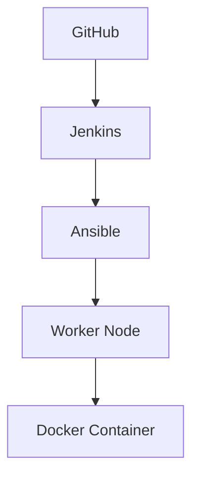

# DevOps Todo App Deployment
## A Complete CI/CD Implementation

---

### Slide 1: Project Overview 🚀


- Modern Todo Application Deployment
- Full CI/CD Pipeline Implementation
- Based on Open Source React Todo App

---

### Slide 2: Technology Stack 🛠️


**Infrastructure:**
- Jenkins for CI/CD
- Docker for Containerization
- Ansible for Configuration
- Nginx for Web Server

**Application:**
- React.js Frontend
- TypeScript
- Material UI
- PWA Support

---

### Slide 3: Architecture Overview 📐




---

### Slide 4: CI/CD Pipeline 🔄


1. **Source Control**
   - GitHub Repository
   - Version Control
   - Code Management

2. **Automation**
   - Jenkins Pipeline
   - Automated Builds
   - Deployment Automation

---

### Slide 5: Docker Implementation 🐳


```dockerfile
# Multi-stage build process
FROM node:20-alpine as builder
...
FROM nginx:alpine
...
```

- Multi-stage Builds
- Optimized Images
- Secure Configuration

---

### Slide 6: Ansible Automation ⚙️


```yaml
- hosts: worker
  tasks:
    - name: Deploy application
      docker_container:
        name: todo-app
        image: todo-app:latest
```

- Infrastructure as Code
- Automated Deployment
- Configuration Management

---

### Slide 7: Application Features 📱


- Task Management
- Theme Customization
- PWA Support
- Responsive Design
- Offline Functionality

---

### Slide 8: Monitoring & Security 🔒


**Monitoring:**
- Health Checks
- Performance Metrics
- Log Management

**Security:**
- Docker Security
- Network Isolation
- Access Control

---

### Slide 9: Deployment Flow 🌊


1. Code Push
2. Jenkins Build
3. Docker Build
4. Ansible Deploy
5. Health Check
6. Production Ready

---

### Slide 10: Future Roadmap 🗺️


**Upcoming Features:**
- Kubernetes Integration
- Automated Testing
- Performance Monitoring
- Blue-Green Deployments

---

### Slide 11: Demo & Resources 🎮

**Live Demo:**
- Application URL: http://worker-ip:1080
- GitHub Repository: [DevOps-Project](https://github.com/Adil61220/DevOps-Project)

**Documentation:**
- Project Documentation
- Setup Guide
- Troubleshooting Guide

---

### Thank You! 👋
**Questions & Discussion**

Contact:
- GitHub: [Project Repository](https://github.com/Adil61220/DevOps-Project)
- Original App: [TodoApp](https://github.com/maciekt07/TodoApp)

---

*Note: Replace image URLs with actual project-specific images when available*
