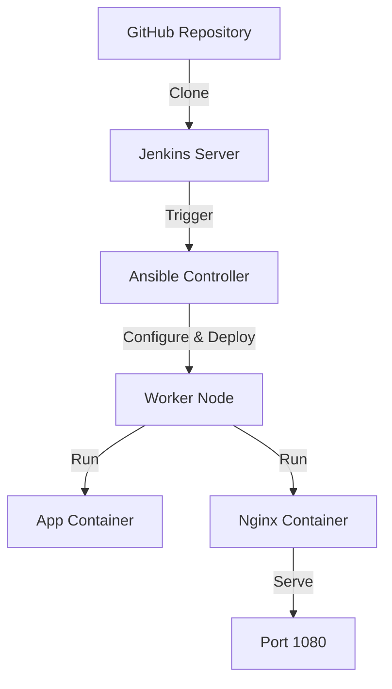

# DevOps Todo App Deployment
## A Complete CI/CD Implementation

---

### Slide 1: Project Overview 🚀


- Modern Todo Application Deployment
- Full CI/CD Pipeline Implementation
- Based on Open Source React Todo App by [maciekt07](https://github.com/maciekt07/TodoApp)
- Production-ready Containerized Solution

---

### Slide 2: Technology Stack 🛠️


**Infrastructure:**
- Jenkins for CI/CD Pipeline
- Docker for Containerization
- Ansible for Configuration Management
- Nginx for Production Web Server

**Application:**
- React.js Frontend with TypeScript
- Material UI Components
- Progressive Web App (PWA)
- Local Storage for Data Persistence

---

### Slide 3: Architecture Overview 📐




---

### Slide 4: CI/CD Pipeline 🔄


1. **Source Control**
   - GitHub Repository: [DevOps-Project](https://github.com/Adil61220/DevOps-Project)
   - Automated Triggers on Push
   - Version Control with Git

2. **Automation**
   - Jenkins Pipeline with Stages
   - Automated Build & Deploy
   - Error Handling & Notifications

---

### Slide 5: Docker Implementation 🐳


**Application Container:**
```dockerfile
FROM node:20-alpine
WORKDIR /app
COPY package*.json ./
RUN npm install
COPY . .
RUN npm run build
```

**Nginx Container:**
```dockerfile
FROM nginx:alpine
COPY nginx.conf /etc/nginx/conf.d/default.conf
COPY dist /usr/share/nginx/html
```

---

### Slide 6: Ansible Automation ⚙️


**Deployment Playbook:**
```yaml
- hosts: worker
  tasks:
    - name: Build application
      docker_compose:
        project_src: "{{ playbook_dir }}"
        files:
          - docker-compose.yml
        state: present
```

**Key Features:**
- Infrastructure as Code
- Idempotent Deployments
- Error Handling & Rollbacks

---

### Slide 7: Application Features 📱


**Todo Application:**
- Task Management with Categories
- Theme Customization Options
- PWA Support for Offline Access
- Responsive Material Design
- Local Storage Integration

---

### Slide 8: Production Setup 🔒


**Docker Compose Configuration:**
```yaml
services:
  app:
    build: .
    volumes:
      - ./dist:/app/dist
  
  nginx:
    build:
      context: .
      dockerfile: Dockerfile.nginx
    ports:
      - "1080:80"
    depends_on:
      - app
```

---

### Slide 9: Deployment Flow 🌊


1. **Development:**
   - Code Push to GitHub
   - Automated Pipeline Trigger

2. **Build Process:**
   - Node.js Build
   - Docker Image Creation

3. **Deployment:**
   - Ansible Configuration
   - Container Orchestration
   - Health Checks

---

### Slide 10: Future Roadmap 🗺️


**Upcoming Features:**
- Kubernetes Integration for Scaling
- Automated Testing Pipeline
- Performance Monitoring Tools
- Blue-Green Deployment Strategy
- Database Integration

---

### Slide 11: Demo & Resources 🎮


**Live Demo:**
- Application URL: http://worker-ip:1080
- GitHub Repository: [DevOps-Project](https://github.com/Adil61220/DevOps-Project)

**Documentation:**
- [Project Documentation](./DOCUMENTATION.md)
- [Setup Guide](./README.md)
- [Workflow Diagram](./workflow.md)

---

### Thank You! 👋


Contact:
- Project Repository: [DevOps-Project](https://github.com/Adil61220/DevOps-Project)
- Original Todo App: [TodoApp](https://github.com/maciekt07/TodoApp)
