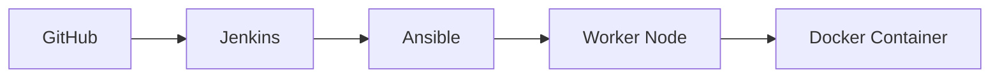

# DevOps Project - React Todo App Deployment

This project demonstrates a complete CI/CD pipeline for deploying a React-based Todo application using Jenkins, Docker, and Ansible. The application is based on the open-source project [TodoApp](https://github.com/maciekt07/TodoApp) by [maciekt07](https://github.com/maciekt07).

## Architecture Overview



## Features

### Original Application Features
- 🔗 Share Tasks by Link or QR Code
- 🎨 Color Themes with Light/Dark Mode
- 📥 Import/Export Tasks
- 📴 Progressive Web App (PWA)
- 📱 Responsive Design
- For more features, visit the [original project](https://github.com/maciekt07/TodoApp)

### DevOps Implementation Features
- 🔄 Automated CI/CD Pipeline
- 🐳 Docker Containerization
- 🚀 Zero-downtime Deployment
- 🔍 Health Checks and Verification
- 🛠️ Automated Dependencies Installation
- 📊 Deployment Status Monitoring

## Technology Stack

### Infrastructure
- **Source Control**: GitHub
- **CI/CD**: Jenkins
- **Configuration Management**: Ansible
- **Containerization**: Docker
- **Web Server**: Nginx (built into container)

### Application
- **Frontend**: React.js
- **Build Tool**: Vite
- **Language**: TypeScript
- **UI Framework**: Material-UI (MUI)

## Project Structure
```
.
├── Dockerfile              # Multi-stage Docker build configuration
├── Jenkinsfile            # Jenkins pipeline definition
├── deploy.yml             # Ansible deployment playbook
├── inventory.ini          # Ansible inventory configuration
├── nginx.conf             # Nginx server configuration
└── src/                   # Application source code
```

## Setup Instructions

### Prerequisites
1. Jenkins Server Requirements:
   ```bash
   # Install required tools on Jenkins server
   sudo apt-get update
   sudo apt-get install -y ansible git
   ```

2. Worker Node Requirements:
   - SSH access
   - Python 3 (will be installed by Ansible)
   - Sudo privileges

### Jenkins Pipeline Setup

1. Create New Pipeline:
   - Open Jenkins Dashboard
   - New Item → Pipeline
   - Configure Git SCM with repository URL

2. Configure Credentials:
   - Add SSH credentials for worker node
   - Add GitHub credentials if repository is private

3. Configure Pipeline Settings:
   - Script Path: `Jenkinsfile`
   - Scan Repository Triggers (optional)

### Worker Node Configuration

1. Update inventory.ini with your worker node details:
   ```ini
   [worker]
   worker_ip ansible_port=22 ansible_user=your_user ansible_password=your_password

   [worker:vars]
   ansible_python_interpreter=/usr/bin/python3
   ansible_ssh_common_args='-o StrictHostKeyChecking=no'
   ansible_become=yes
   ansible_become_method=sudo
   ansible_become_pass=your_sudo_password
   ```

## Deployment Workflow

1. **Jenkins Pipeline Stages**:
   ```groovy
   Verify Tools → Deploy with Ansible
   ```

2. **Ansible Deployment Process**:
   - Install required packages (Docker, Python, Git)
   - Configure Docker service
   - Clone repository
   - Build Docker image
   - Deploy container
   - Verify deployment

3. **Deployment Verification**:
   - Health checks
   - Port availability check
   - HTTP response verification

## Usage

1. **Trigger Deployment**:
   - Manual: Click "Build Now" in Jenkins
   - Automatic: Configure webhook triggers

2. **Monitor Deployment**:
   - Jenkins Console Output
   - Ansible Deployment Logs
   - Container Logs on Worker

3. **Access Application**:
   ```
   http://worker_ip:1080
   ```

## Troubleshooting

1. **Jenkins Pipeline Failures**:
   - Check Jenkins console output
   - Verify Ansible is installed
   - Ensure proper permissions

2. **Ansible Deployment Issues**:
   - Check worker node connectivity
   - Verify sudo privileges
   - Check Docker service status

3. **Container Issues**:
   - Check Docker logs:
     ```bash
     docker logs todo-app
     ```
   - Verify port availability
   - Check container status:
     ```bash
     docker ps -a
     ```

## Contributing
1. Fork the repository
2. Create your feature branch
3. Commit your changes
4. Push to the branch
5. Create a Pull Request

## Credits
- Original Todo Application: [TodoApp](https://github.com/maciekt07/TodoApp) by [maciekt07](https://github.com/maciekt07)
- Live Demo of Original App: [react-cool-todo-app.netlify.app](https://react-cool-todo-app.netlify.app/)

## License
This project is licensed under the MIT License - see the [LICENSE](LICENSE) file for details.
