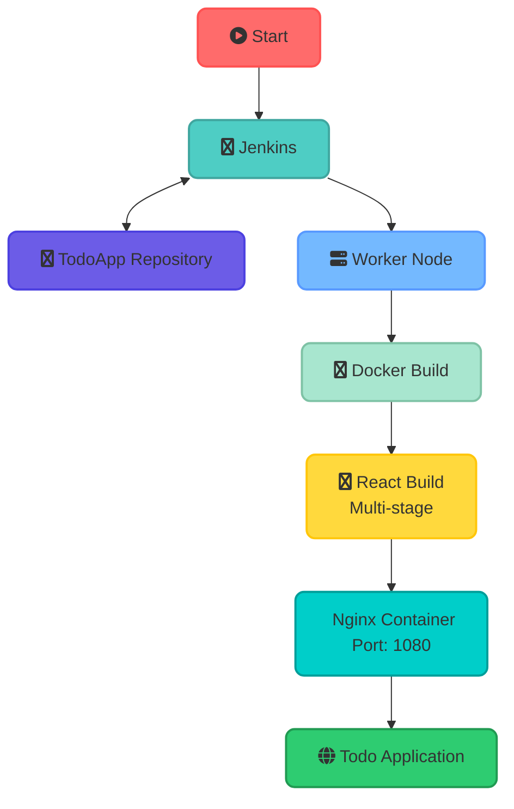

---
config:
  theme: mc
---

### Workflow Description:
1. Pipeline starts when triggered
2. Jenkins checks out code from TodoApp repository
3. Worker node receives deployment tasks
4. Docker builds multi-stage image:
   - Stage 1: React build with Node.js
   - Stage 2: Nginx with built files
5. Final container serves app on port 1080
</rewritten_file>
